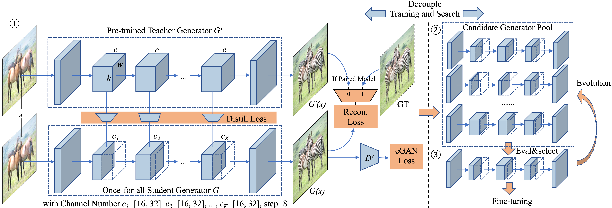
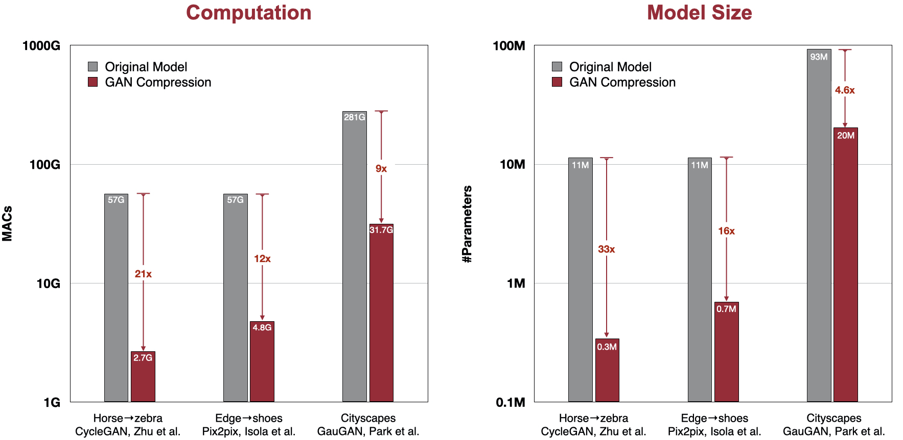

# GAN Compression
### | [paper](https://arxiv.org/abs/2003.08936) |

** В этой версии оптимизирована только модель pix2pix

*Предсавляется метод сжатия GAN моделей при котором, сокращается вычисления условных GAN при сохранении их точности. Метод эффективен для широкого спектра архитектур генератоов, а также может использоваться для парных и не парных моделей.*

GAN Compression: Efficient Architectures for Interactive Conditional GANs 
[Muyang Li](https://lmxyy.me/), [Ji Lin](http://linji.me/), [Yaoyao Ding](https://yaoyaoding.com/), [Zhijian Liu](http://zhijianliu.com/), [Jun-Yan Zhu](https://www.cs.cmu.edu/~junyanz/), and [Song Han](https://songhan.mit.edu/) 
MIT, Adobe Research, SJTU 
In CVPR 2020.  

## Demos

  

## Overview

*Структура сжатия GAN: ① Учитывая предварительно обученный генератор G для учителей', мы создаем меньший генератор G для учащихся “один для всех”, который содержит все возможные номера каналов карты путем распределения веса. Мы выбираем разные номера каналов для студенческого генератора G на каждом этапе обучения. ② Затем мы извлекаем множество подгенераторов из генератора ”раз для всех" и оцениваем их производительность. Переподготовка не требуется, что является преимуществом генератора “раз для всех”. 3 Наконец, мы выбираем наилучший субгенератор с учетом целевой степени сжатия и целевой производительности (FIND или mIoU), используя либо метод перебора, либо метод эволюционного поиска. При желании мы выполняем дополнительную тонкую настройку и получаем окончательную сжатую модель.*

Если своими словами и более подробно, берётся предобученная модель генератора учителя, далее с помощью генетического алгоритма мы создаём популяцию архитектур учеников. Созданная архитектура представляет собой вектор, содержащий количество карт признаков. Генетический алгоритм случайным образом уменьшает количество карт признаков и затем мы оцениваем как работает новая архитектура по метрике FID (данная метрика оценивает качество сгенерироанного изображения). Второй ключевой метрикой яляется MAC's, она показывает количество операций выполняемых графическим процессором. Генетический алгоритм при генерации новых архитектур использует ограничение на вычислительный бюджет (if macs <= self.opt.budget) т.е. новая архитектура выбирается с учетом того, что число ее операций не больше чем бюджет. 
1) Сначала модель рандомит себе семплы (архитектуры) изменяя число каналов 
2) Далее, модель закидывает тестовые примеры в полученные архитектуры, оценивает FID, ранжирует их и берет 25% лучших
3) Цикл по числу родителей, берем рандомного родителя, по каждому его слою мутируем каналы с вероятностью мутации = 0.3 - получаем одного ребенка => 25% родителей и 50% детей мутировавших
4) Добиваем оставшихся детей кроссовером (скрещиваем слои у двух родителей на каждой итерации, берем рандомно для каждого слоя у первого или второго родителя число каналов) 
5) Если число итераций меньше N, то возвращаемся к шагу 2

Далее успешная архитектура ученика обучается с ипользованием Дисстиляции знаний. Дисстиляция знаний - процесс передачи знаний от большой модели (учителя, предобученной модели pix2pix) к меньше модели (ученика, новой сгенерированной архитектуре). Дисстиляция знаний имеет различные виды по принципу работы, здесь конкретно передача знаний осуществляется послойно, мы смотрим значение функции потерь на слое учителя и проверяем какое значение получилось на слое ученика, если видим слишком большое отклоение от учителя, корректируется процесс обучения ученика. Количество слоев у учителя и ученика одинаковые, поэтому это является возможным. Ученик стремится повторить поведения учителя во время обучения, стремится получить такие же значения функции потерь, это позволяет сохранить точность сгенерированных изображений.

На примере датасета map2sat модели pix2pix, количество операций выполняемым графическом процессором стало меньше в ~12 раз, 56.8 G -> 4.68 G (данная метрика называетя MAC's), а количество параметров модели уменьшилоь в ~15 раз (11.4 млн -> 0.750 млн) 

## Prerequisites

* Linux
* Python 3
* CPU or NVIDIA GPU + CUDA CuDNN

### Performance of Released Models

Here we show the performance of all our released models:

<table style="undefined;table-layout: fixed; width: 868px">
<colgroup>
<col style="width: 130px">
<col style="width: 130px">
<col style="width: 130px">
<col style="width: 130px">
<col style="width: 130px">
<col style="width: 109px">
<col style="width: 109px">
</colgroup>
<thead>
  <tr>
    <th rowspan="2">Model</th>
    <th rowspan="2">Dataset</th>
    <th rowspan="2">Method</th>
    <th rowspan="2">#Parameters</th>
    <th rowspan="2">MACs</th>
    <th colspan="2">Metric</th>
  </tr>
  <tr>
    <td>FID</td>
    <td>mIoU</td>
  </tr>
</thead>
<tbody>
  <tr>
    <td>GAN Compression (Paper)</td>
    <td>0.342M</td>
    <td>2.67G</td>
    <td>65.33</td>
    <td>--</td>
  </tr>
  <tr>
    <td>GAN Compression (Retrained)</td>
    <td>0.357M</td>
    <td>2.55G</td>
    <td>65.12</td>
    <td>--</td>
  </tr>
  <tr>
    <td>Fast GAN Compression</td>
    <td>0.355M</td>
    <td>2.64G</td>
    <td>65.19</td>
    <td>--</td>
  </tr>
  <tr>
    <td rowspan="11">Pix2pix</td>
    <td rowspan="4">edges→shoes</td>
    <td>Original</td>
    <td>11.4M</td>
    <td>56.8G</td>
    <td>24.12</td>
    <td>--</td>
  </tr>
  <tr>
    <td>GAN Compression (Paper)</td>
    <td>0.700M</td>
    <td>4.81G</td>
    <td>26.60</td>
    <td>--</td>
  </tr>
  <tr>
    <td>GAN Compression (Retrained)</td>
    <td>0.822M</td>
    <td>4.99G</td>
    <td>26.70</td>
    <td>--</td>
  </tr>
  <tr>
    <td>Fast GAN Compression</td>
    <td>0.703M</td>
    <td>4.83G</td>
    <td>25.76</td>
    <td>--</td>
  </tr>
  <tr>
    <td rowspan="4">Cityscapes</td>
    <td>Original</td>
    <td>11.4M</td>
    <td>56.8G</td>
    <td>--</td>
    <td>42.06</td>
  </tr>
  <tr>
    <td>GAN Compression (Paper)</td>
    <td>0.707M</td>
    <td>5.66G</td>
    <td>--</td>
    <td>40.77</td>
  </tr>
  <tr>
    <td>GAN Compression (Retrained)</td>
    <td>0.781M</td>
    <td>5.59G</td>
    <td>--</td>
    <td>38.63</td>
  </tr>
  <tr>
    <td>Fast GAN Compression</td>
    <td>0.867M</td>
    <td>5.61G</td>
    <td>--</td>
    <td>41.71</td>
  </tr>
  <tr>
    <td rowspan="3">map→arial photo </td>
    <td>Original</td>
    <td>11.4M</td>
    <td>56.8G</td>
    <td>47.91</td>
    <td>--</td>
  </tr>
  <tr>
    <td>GAN Compression</td>
    <td>0.746M</td>
    <td>4.68G</td>
    <td>48.02</td>
    <td>--</td>
  </tr>
  <tr>
    <td>Fast GAN Compression</td>
    <td>0.708M</td>
    <td>4.53G</td>
    <td>48.67</td>
    <td>--</td>
  </tr>
  <tr>
    <td>GAN Compression (Paper)</td>
    <td>20.4M</td>
    <td>31.7G</td>
    <td>55.19</td>
    <td>61.22</td>
  </tr>
  <tr>
    <td>GAN Compression (Retrained)</td>
    <td>21.0M</td>
    <td>31.2G</td>
    <td>56.43</td>
    <td>60.29</td>
  </tr>
  <tr>
    <td>Fast GAN Compression</td>
    <td>20.2M</td>
    <td>31.3G</td>
    <td>56.25</td>
    <td>61.17</td>
  </tr>
  <tr>
    <td rowspan="2">COCO-Stuff</td>
    <td>Original</td>
    <td>97.5M</td>
    <td>191G</td>
    <td>21.38</td>
    <td>38.78</td>
  </tr>
  <tr>
    <td>Fast GAN Compression</td>
    <td>26.0M</td>
    <td>35.5G</td>
    <td>25.06</td>
    <td>35.05</td>
  </tr>
  <tr>
    <td>Fast GAN Compression</td>
    <td>1.10M</td>
    <td>2.63G</td>
    <td>30.53</td>
    <td>--</td>
  </tr>
</tbody>
</table>

